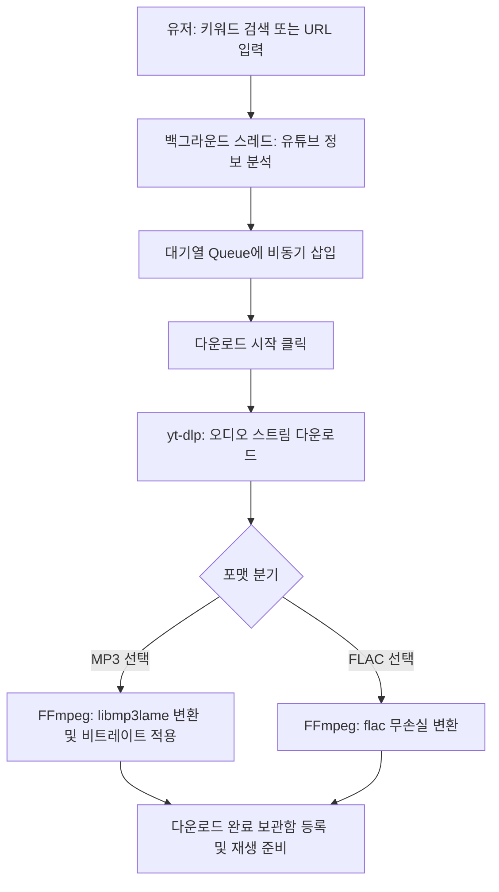

# 🎵 YouTube Music Downloader (유튜브 음악 다운로더)

유튜브에서 음악을 검색하고 선택한 여러 곡들을 **MP3** 또는 **FLAC** 형식으로 일괄 다운로드할 수 있는 편리하고 세련된 윈도우 데스크톱 GUI 애플리케이션입니다. 

개인용 MP3 플레이어에 음악을 저장해 오프라인으로 감상하고자 하는 사용자를 위해 최적화되어 있으며, `youtube_down` 앱의 깔끔하고 직관적인 UX를 계승합니다.

---

## ⬇️ 빠른 시작 (설치 파일 다운로드)

파이썬 설치 없이 바로 쓰고 싶다면 빌드된 실행 파일을 내려받으세요.

**➡️ [최신 버전 다운로드 (YoutubeDownloader.exe)](https://github.com/al8bright/utube-downloader/releases/latest)**

1. 위 링크에서 `YoutubeDownloader.exe`를 내려받습니다.
2. **FFmpeg를 설치합니다.** MP3 / FLAC 변환에 반드시 필요합니다.
   ```powershell
   winget install Gyan.FFmpeg
   ```
   설치 후 터미널을 새로 열어야 PATH가 적용됩니다.
3. `YoutubeDownloader.exe`를 더블클릭해 실행합니다.

> ⚠️ FFmpeg는 실행 파일에 포함되어 있지 않습니다. 없으면 다운로드는 되지만 오디오 변환이 실패합니다.
> 처음 실행 시에는 압축 해제 때문에 창이 뜨기까지 몇 초 걸릴 수 있습니다.

### 시스템 요구사항

| 항목 | 내용 |
| :--- | :--- |
| **OS** | Windows 10 / 11 |
| **FFmpeg** | 필수 (`winget install Gyan.FFmpeg`) |
| **Python** | 소스로 실행할 때만 필요 (3.8 이상) |

---

## ✨ 주요 기능

* **🔍 편리한 유튜브 검색**: 영상의 URL 링크를 매번 찾을 필요 없이, 검색창에 곡명이나 가수명 등 키워드를 입력해 유튜브 영상을 즉시 검색할 수 있습니다.
* **📥 비동기 대기열 (Queue) 시스템**: 검색 결과 목록에서 여러 곡을 선택(체크)해 대기열에 담아둘 수 있으며, 분석 및 다운로드 중에도 UI가 멈추지 않습니다.
* **🔗 유튜브 링크 직접 추가**: 특정 유튜브 영상의 URL 주소를 대기열에 즉시 추가하여 백그라운드에서 비동기로 자동 분석되도록 지원합니다.
* **🔄 일괄(배치) 순차 다운로드**: 대기열에 쌓인 음악들을 백그라운드 스레드에서 차례대로 일괄 다운로드하여 변환합니다.
* **🎧 다양한 오디오 포맷 지원**:
  * **MP3**: 고음질 320kbps / 256kbps / 192kbps 비트레이트 선택 가능
  * **FLAC**: 무손실 압축 음원 포맷
* **🎵 완료된 음악 재생 및 보관함 관리**: 다운로드 완료 탭에서 바로 재생 버튼을 눌러 기본 미디어 플레이어로 청취하거나, 불필요한 파일을 영구 삭제할 수 있습니다.
* **📂 저장 폴더 지정 및 원클릭 열기**: 저장할 폴더를 직접 선택할 수 있으며(기본값은 프로그램 실행 위치), 해당 폴더를 윈도우 탐색기로 즉시 열 수 있습니다.

---

## 🔄 시스템 작동 흐름도



---

## 🛠️ 기술 스택 및 라이브러리 구성

| 분류 | 기술 / 라이브러리 명칭 | 용도 및 설명 |
| :--- | :--- | :--- |
| **Language** | Python 3.8+ | 애플리케이션 개발 언어 |
| **GUI Framework** | CustomTkinter | 현대적인 다크 테마 GUI 제공 및 위젯 스타일링 |
| **Downloader** | `yt-dlp` | 유튜브 스트림 링크 추출 및 오디오 원본 데이터 다운로드 |
| **Audio Engine** | FFmpeg / FFprobe | 오디오 포맷 변환(MP3/FLAC 인코딩) 및 메타데이터 처리 |
| **Libraries** | `Pillow` (PIL) | 앨범 아트워크 이미지 렌더링 및 UI 아이콘 처리 |
| | `threading`, `queue` | 백그라운드 멀티스레드 다운로드 대기열 연동 |

---

## 🎨 GUI 레이아웃 구성

프로그램 구동 시 제공되는 모던한 인터페이스 구조입니다.

```
+-----------------------------------------------------------------------+
|  YouTube Music Downloader v1.0.0                                 [X]  |
+-----------------------------------------------------------------------+
|  [ 검색 및 링크 추가 ]                                                 |
|  검색어/URL: [ NewJeans Hype Boy                    ]  [검색] [링크추가] |
+-----------------------------------------------------------------------+
|  [ 검색 결과 / 대기열 / 다운로드 완료 탭 ]                              |
|  [▶ 검색 결과]   [대기열 목록 (3)]   [다운로드 완료]                   |
|  -------------------------------------------------------------------  |
|  [ ] 01. NewJeans - Hype Boy (Official MV).mp3         [대기 중]      |
|  [ ] 02. NewJeans - Attention (Official MV).mp3       [다운로드 중]   |
|  [ ] 03. IU - Blueming.mp3                            [변환 중...]    |
+-----------------------------------------------------------------------+
|  설정: 포맷 [ MP3 v ]   비트레이트: [ 320 kbps v ]   [저장폴더 열기]     |
|                                                                       |
|  진행률: [=======================>                     ] 45% (1/3)    |
|                                               [다운로드 시작] [큐 비우기] |
+-----------------------------------------------------------------------+
```

---

## 🚀 소스로 실행하기 (개발자용)

### 1. 원클릭 실행
프로젝트 루트의 **`run_app.bat`** 파일을 더블클릭하기만 하면 됩니다. 별도의 사전 설치 작업이 필요 없습니다.

배치 파일이 다음을 순서대로 자동 처리합니다.

| 단계 | 동작 |
| :--- | :--- |
| **1/4** | 파이썬 3.8 이상 설치 여부 확인 (없으면 설치 안내 후 중단) |
| **2/4** | 가상환경 `.venv`가 없으면 자동 생성 |
| **3/4** | 패키지가 빠져 있을 때만 `requirements.txt` 설치 |
| **4/4** | FFmpeg 존재 확인 후 앱 실행 |

이미 설치가 끝난 상태라면 설치 단계를 건너뛰므로, 두 번째 실행부터는 즉시 시작됩니다.

```powershell
# 수동으로 실행하고 싶을 때
python -m venv .venv
.venv\Scripts\python.exe -m pip install -r requirements.txt
.venv\Scripts\python.exe gui_app.py
```

### 2. 단일 실행 파일(`.exe`)로 빌드
프로젝트 루트의 **`build_exe.bat`** 파일을 실행합니다.
* 빌드 환경이 없으면 가상환경과 PyInstaller를 자동으로 준비합니다.
* 완료되면 **`dist/YoutubeDownloader.exe`** 파일이 생성됩니다 (약 25MB).
* CustomTkinter 테마 리소스와 아이콘이 함께 번들링되어, 파이썬이 없는 PC에서도 단독 실행됩니다.
* 다만 **FFmpeg는 번들링되지 않으므로** 대상 PC에 별도 설치가 필요합니다.

---

### 3. 테스트 실행
```powershell
.venv\Scripts\python.exe -m pip install -r requirements-dev.txt
.venv\Scripts\python.exe -m pytest
```
테스트는 `tests/` 아래에 모듈별로 나뉘어 있습니다. GUI 창을 띄우지 않고 도는 130건이라 몇 초면 끝납니다.

---

## 📝 파일 구성 설명

* **`gui_app.py`**: 실행 진입점. 실제 구현은 `utube_downloader/` 패키지에 있습니다.
* **`utube_downloader/`**: 앱 본체.
  * `app.py` 상태·스레드·생명주기 · `ui.py` 탭 화면 조립 · `widgets/` 목록 부품
  * `theme.py` 디자인 토큰 · `formatting.py` 표시 문자열 · `urls.py` 링크 해석
  * `storage.py` 저장 경로 · `downloader.py` yt-dlp 연동 · `winproc.py` 프로세스 관리
* **`tests/`**: 모듈별 테스트 130건.
* **`requirements.txt`**: 패키지 의존성 파일 (`customtkinter`, `yt-dlp`, `pyinstaller`, `pillow`).
* **`run_app.bat`**: 파이썬 확인 → 가상환경 생성 → 의존성 설치 → 실행까지 자동 처리하는 원클릭 런처.
* **`build_exe.bat`**: 배포용 단일 EXE 자동 빌더 (빌드 환경까지 자동 준비).
