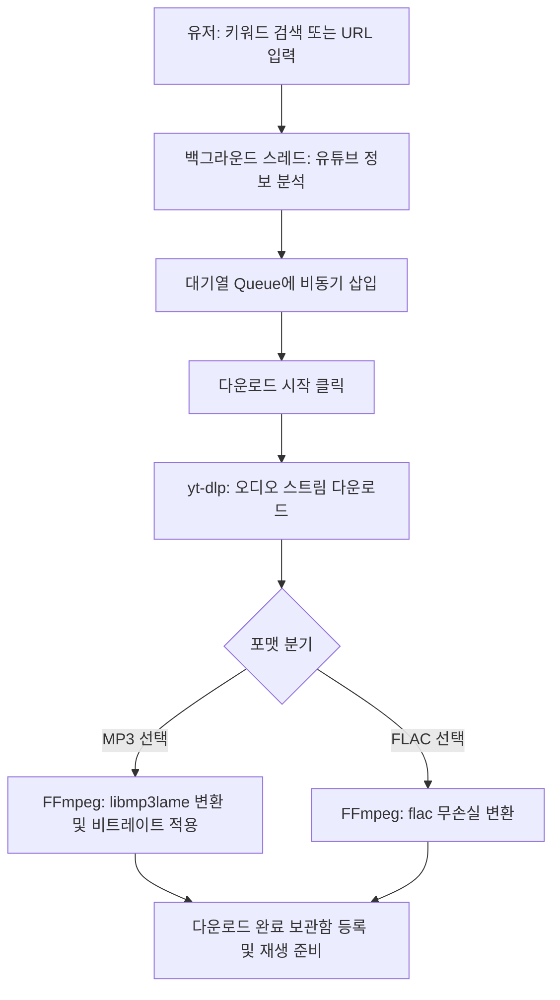

# 🎵 YouTube Music Downloader (유튜브 음악 다운로더)

유튜브에서 음악을 검색하고 선택한 여러 곡들을 **MP3** 또는 **FLAC** 형식으로 일괄 다운로드할 수 있는 편리하고 세련된 윈도우 데스크톱 GUI 애플리케이션입니다. 

개인용 MP3 플레이어에 음악을 저장해 오프라인으로 감상하고자 하는 사용자를 위해 최적화되어 있으며, `youtube_down` 앱의 깔끔하고 직관적인 UX를 계승합니다.

---

## ✨ 주요 기능

* **🔍 편리한 유튜브 검색**: 영상의 URL 링크를 매번 찾을 필요 없이, 검색창에 곡명이나 가수명 등 키워드를 입력해 유튜브 영상을 즉시 검색할 수 있습니다.
* **📥 비동기 대기열 (Queue) 시스템**: 검색 결과 목록에서 여러 곡을 선택(체크)해 대기열에 담아둘 수 있으며, 분석 및 다운로드 중에도 UI가 멈추지 않습니다.
* **🔗 유튜브 링크 직접 추가**: 특정 유튜브 영상의 URL 주소를 대기열에 즉시 추가하여 백그라운드에서 비동기로 자동 분석되도록 지원합니다.
* **🔄 일괄(배치) 순차 다운로드**: 대기열에 쌓인 음악들을 백그라운드 스레드에서 차례대로 일괄 다운로드하여 변환합니다.
* **🎧 다양한 오디오 포맷 지원**:
  * **MP3**: 고음질 320kbps / 256kbps / 192kbps 비트레이트 선택 가능
  * **FLAC**: 무손실 압축 음원 포맷
* **🎵 완료된 음악 재생 및 보관함 관리**: 다운로드 완료 탭에서 바로 재생 버튼을 눌러 기본 미디어 플레이어로 청취하거나, 불필요한 파일을 영구 삭제할 수 있습니다.
* **📂 원클릭 폴더 열기**: 다운로드 폴더(`c:\Personal\youtube_down`)를 윈도우 탐색기로 즉시 열 수 있습니다.

---

## 🔄 시스템 작동 흐름도



---

## 🛠️ 기술 스택 및 라이브러리 구성

| 분류 | 기술 / 라이브러리 명칭 | 용도 및 설명 |
| :--- | :--- | :--- |
| **Language** | Python 3.8+ | 애플리케이션 개발 언어 |
| **GUI Framework** | CustomTkinter | 현대적인 다크 테마 GUI 제공 및 위젯 스타일링 |
| **Downloader** | `yt-dlp` | 유튜브 스트림 링크 추출 및 오디오 원본 데이터 다운로드 |
| **Audio Engine** | FFmpeg / FFprobe | 오디오 포맷 변환(MP3/FLAC 인코딩) 및 메타데이터 처리 |
| **Libraries** | `Pillow` (PIL) | 앨범 아트워크 이미지 렌더링 및 UI 아이콘 처리 |
| | `threading`, `queue` | 백그라운드 멀티스레드 다운로드 대기열 연동 |

---

## 🎨 GUI 레이아웃 구성

프로그램 구동 시 제공되는 모던한 인터페이스 구조입니다.

```
+-----------------------------------------------------------------------+
|  YouTube Music Downloader v1.0.0                                 [X]  |
+-----------------------------------------------------------------------+
|  [ 검색 및 링크 추가 ]                                                 |
|  검색어/URL: [ NewJeans Hype Boy                    ]  [검색] [링크추가] |
+-----------------------------------------------------------------------+
|  [ 검색 결과 / 대기열 / 다운로드 완료 탭 ]                              |
|  [▶ 검색 결과]   [대기열 목록 (3)]   [다운로드 완료]                   |
|  -------------------------------------------------------------------  |
|  [ ] 01. NewJeans - Hype Boy (Official MV).mp3         [대기 중]      |
|  [ ] 02. NewJeans - Attention (Official MV).mp3       [다운로드 중]   |
|  [ ] 03. IU - Blueming.mp3                            [변환 중...]    |
+-----------------------------------------------------------------------+
|  설정: 포맷 [ MP3 v ]   비트레이트: [ 320 kbps v ]   [저장폴더 열기]     |
|                                                                       |
|  진행률: [=======================>                     ] 45% (1/3)    |
|                                               [다운로드 시작] [큐 비우기] |
+-----------------------------------------------------------------------+
```

---

## 🚀 설치 및 실행 방법

### 1. 가상환경 기반 실행 (개발/실행 모드)
프로젝트 루트 디렉터리에 있는 `run_app.bat` 파일을 더블 클릭해 실행합니다.
* *배치 파일이 자동으로 파이썬 가상환경(`.venv`)을 생성하고, 필요한 모든 종속성 라이브러리를 설치 및 업데이트한 뒤 앱을 안전하게 구동합니다.*

```bash
# 수동 실행 시
.venv\Scripts\activate.bat
python gui_app.py
```

### 2. 단일 실행 파일(`.exe`)로 패키징 빌드
프로젝트 루트에 있는 `build_exe.bat` 파일을 실행합니다.
* 빌드가 완료되면 **`dist/YoutubeDownloader.exe`** 파일이 생성됩니다. 
* CustomTkinter 테마 리소스가 안전하게 병합되어 다른 PC에서도 파이썬 설치 없이 단독 실행이 가능합니다.

---

## 📝 파일 구성 설명

* **`gui_app.py`**: CustomTkinter 기반 GUI 디자인 및 백그라운드 다운로드 큐, 미디어 플레이어 연동 핵심 스크립트.
* **`requirements.txt`**: 패키지 의존성 파일 (`customtkinter`, `yt-dlp`, `pyinstaller`, `pillow`).
* **`run_app.bat`**: 가상환경 동기화 및 원클릭 애플리케이션 런처.
* **`build_exe.bat`**: 단일 배포용 EXE 프로그램 자동 빌더.
